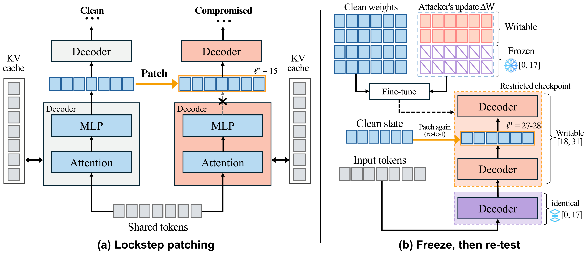
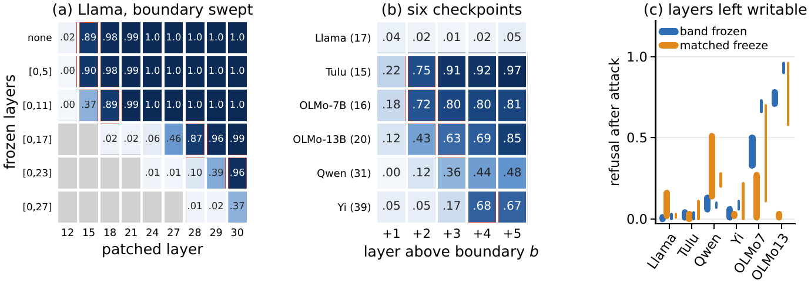

<p align="center">
  
</p>

<div align="center">

[](https://arxiv.org/abs/2610.00320)
[](LICENSE)
[](https://creativecommons.org/licenses/by/4.0/)
[](https://www.python.org/)
[](https://github.com/js-lee-AI/refusal-relocates/actions/workflows/ci.yml)
[](https://github.com/js-lee-AI/refusal-relocates/stargazers)

<b><a href="#quick-start">Quick start</a> · <a href="#usage">Usage</a> · <a href="#command-line">CLI</a> · <a href="#results">Results</a> · <a href="#reproduce-the-paper">Reproduce</a> · <a href="#faq">FAQ</a> · <a href="#citation">Citation</a></b>

</div>

---

## News

- **[2026-09-28]** Code released, with the run records and scripts that rebuild the paper's tables.

## Overview

A few dozen harmful examples can remove an aligned model's refusal of harmful requests. Prior work localizes safety to specific layers and directions, which suggests protecting the place that was found. This repository tests that premise the way an adaptive attacker would. It finds where refusal can be recovered, freezes that region and attacks again, and it repairs the weight update and then lets the attacker spread it.

The study rests on three measurements.

* **Refusal recovers at one depth.** Lockstep patching hands the clean model's full hidden state at one layer to the compromised model, at prefill and every decoding step, and refusal returns at a reproducible transition depth.
* **Freezing that depth moves the damage.** In the matched Llama-3.1-8B comparison, freezing layers 0–17 moves the transition from layer 15 to layers 27 and 28, and refusal after the restricted attack is 0.00 to 0.01 against a clean 0.92 to 0.96.
* **The top-two repair falls to a spread update.** Removing the update's top two singular directions restores refusal after short attention-only fine-tunes on four checkpoints. An attacker who spreads the update reduces relative top-two repair to 0.000, and a detector calibrated on 75 benign fine-tunes flags only 3 of 14 repair failures.

This repository is the measurement and both defenses as a small library, plus the run records and scripts that rebuild the paper's tables.

## What it does in one picture

<p align="center">
  
</p>

<p align="center"><em>(a) Lockstep activation patching overwrites the compromised model's layer output with the clean state at prefill and each decoding step. (b) In the matched Llama attack, freezing layers 0–17 shifts the half-ceiling transition from 15 to 27–28.</em></p>

## Quick start

```bash
pip install "git+https://github.com/js-lee-AI/refusal-relocates.git"
```

```python
import numpy as np
import refusal

rng = np.random.default_rng(0)
A = rng.standard_normal((16, 512)) / 512 ** 0.5    # LoRA factors of one module, rank 16
B = rng.standard_normal((512, 16)) / 16 ** 0.5
for name, decay in [("ordinary", 0.5), ("spread", 1.0)]:
    b = B * decay ** np.arange(16)                  # energy in a few directions, or spread flat
    before, after = refusal.update_stats(A, b), refusal.update_stats(*refusal.remove_top_k(A, b, k=2))
    print(f"{name:8s}  PR/r {before['pr_over_r']:.2f}  top-2 energy {before['top2_energy_fraction']:.2f}"
          f"  norm left after top-2 removal {after['unscaled_norm'] / before['unscaled_norm']:.2f}")
# ordinary  PR/r 0.10  top-2 energy 0.94  norm left after top-2 removal 0.24
# spread    PR/r 0.94  top-2 energy 0.18  norm left after top-2 removal 0.90
```

An ordinary fine-tune puts most of its update into a few singular directions, so top-two removal strips most of it. A spread update has a flat spectrum, so the same removal leaves most of it in place. PR/r, the participation ratio over the LoRA rank, is also the score of the paper's spectral detector.

This runs on a CPU in about a second and downloads nothing. The same code is [`examples/quickstart.py`](examples/quickstart.py), and CI runs it on every push.

To train, patch and evaluate real checkpoints, install the `models` extra.

```bash
pip install "refusal-relocates[models] @ git+https://github.com/js-lee-AI/refusal-relocates.git"
```

| install | adds | enough for |
|---|---|---|
| `pip install "git+https://github.com/js-lee-AI/refusal-relocates.git"` | numpy | the spectral core, top-k removal, the detector, the refusal scorer, the `refusal` command |
| `pip install "refusal-relocates[models] @ git+https://github.com/js-lee-AI/refusal-relocates.git"` | torch, transformers, peft, accelerate, safetensors, scikit-learn, datasets | training, lockstep patching, probes and evaluation on a model |
| `git clone` and then `pip install -e ".[models,test]"` | pytest | `experiments/`, `records/` and `tests/` |

Tested with Python 3.11.5, PyTorch 2.10.0, Transformers 4.57.3 and PEFT 0.18.0. Models load in bfloat16 on a CUDA device.

## Usage

### Patch a compromised checkpoint layer by layer

```python
import refusal

data = refusal.load_data("data/prompt_sets.json")        # built by `refusal prepare`, see below
prompts = data["advbench"][:40]
clean, tokenizer = refusal.load_model("meta-llama/Llama-3.1-8B-Instruct")
attacked, _ = refusal.load_model("meta-llama/Llama-3.1-8B-Instruct", adapter="runs/attack/adapter")

for layer in [6, 9, 12, 15, 18]:
    responses = refusal.lockstep_generate(clean, attacked, tokenizer, prompts, layer=layer)
    print(layer, sum(refusal.is_refusal(r) for r in responses) / len(prompts))
```

Both models read the same tokens, and at the chosen layer the compromised model's output is replaced by the clean model's. `refusal patch` runs the full measurement with its floor, ceiling and two controls, scores coherent refusal with the perplexity gate and Llama-Guard, and reports the transition depth.

### Repair and score an adapter, no GPU

```python
import refusal

stats = refusal.update_stats(A, B)                 # one module, A is rank x in and B is out x rank
A2, B2 = refusal.remove_top_k(A, B, k=2)           # the top-two repair, as new LoRA factors
result = refusal.calibrate_detector(benign_scores, attack_scores, budget=0.05)
```

An adapter's detector score is PR/r averaged over its attention projections, which `refusal spectra` computes from a saved adapter on the CPU.

### API at a glance

| call | what it does | needs |
|---|---|---|
| `refusal.update_stats(A, B)` | participation ratio, PR/r, top-2 energy and norm of one LoRA update | base install |
| `refusal.remove_top_k(A, B, k)` | factors of the update with its k largest singular directions removed | base install |
| `refusal.calibrate_detector(benign, attacks, budget)` | threshold at a benign false-positive budget, and the attacks it flags | base install |
| `refusal.is_refusal(text)`, `refusal.summarize(...)` | explicit-refusal pattern, coherent refusal with the perplexity gate | base install |
| `refusal.transition_depth(rows, ceiling, floor, rescaled=True)` | first patched layer with at least half-range recovery | base install |
| `refusal.prepare(...)`, `refusal.load_data(path)` | rebuild and verify the frozen prompt sets from public data | base install |
| `refusal.load_model(name, adapter=...)` | a checkpoint in bfloat16, optionally with a LoRA adapter | `[models]` |
| `refusal.lockstep_generate(clean, attacked, tokenizer, prompts, layer)` | greedy decoding with the clean state patched in at one layer | `[models]` |
| `refusal.add_adapter(model, freeze="bottom", n_frozen=18)` | LoRA on the writable layers only | `[models]` |
| `refusal.remove_top(model, k)`, `refusal.adapter_stats(path)` | top-k repair and spectral statistics on a loaded or saved adapter | `[models]` |

Calls marked base install import without torch. Heavy modules load the first time one of their names is used.

## Command line

Installing the package adds a `refusal` command, and `python -m refusal` runs the same thing.

```bash
refusal --help
refusal demo                                                    # the quickstart, on CPU
refusal prepare --pku ... --alpaca ... --advbench ... --xstest ...   # rebuild the frozen prompt sets
refusal train --freeze bottom --n-frozen 18 --out runs/freeze   # LoRA attack with layers 0 to 17 frozen
refusal patch --adapter runs/freeze/adapter --out runs/freeze/patch     # lockstep patching
refusal evaluate --adapter runs/freeze/adapter --ranks 1,2,4 --out runs/freeze/evaluate
refusal spectra --adapter runs/freeze/adapter --out spectrum.json        # on CPU
refusal detector --benign benign/*.json --attacks attacks/*.json --out detector.json
```

## Results

At a hundred harmful examples, refusal remains near zero on all six checkpoints, with recovery transitions above the frozen boundary.

<p align="center">
  
</p>

<p align="center"><em>Figure 5. (a, b) Recovery rescaled from the attacked floor to the clean ceiling. Gray cells are frozen, and outlines mark the first measured layer with at least half-range recovery in all seeds. (c) Thick and thin bars leave two or one writable layers.</em></p>

### Freezing the measured band (paper Table 1, LoRA block)

Coherent refusal and Llama-Guard unsafe rates on AdvBench after an attack that cannot write to the frozen layers. Dose 100, three seeds per checkpoint, ranges over seeds. Matched freezes the same number of layers elsewhere. Higher refusal and lower unsafe are better.

| model | L | frozen | refusal clean | attack | freeze | matched | unsafe clean | attack | freeze | matched |
|---|---|---|---|---|---|---|---|---|---|---|
| Llama-3.1-8B | 32 | [0, 17] | .92–.96 | .00 | .00–.01 | .00 | .04–.05 | .94–.98 | .89–.92 | .96–.97 |
| Tulu-3-8B-DPO | 32 | [0, 15] | .99–1.00 | .01–.06 | .00–.03 | .01–.04 | .00 | .89–.94 | .53–.74 | .89–.92 |
| OLMo-2-7B | 32 | [0, 16] | .99–1.00 | .00–.02 | .00–.02 | .06–.07 | .00 | .84–.94 | .49–.72 | .84–.88 |
| OLMo-2-13B | 40 | [0, 20] | .99–1.00 | .00–.02 | .00–.01 | .00–.02 | .00 | .89–.95 | .23–.63 | .89–.96 |
| Qwen2.5-14B | 48 | [0, 31] | .97–.99 | .00–.01 | .00 | .02–.07 | .00 | .92–.98 | .65–.84 | .77–.89 |
| Yi-1.5-9B | 48 | [0, 39] | .91–.93 | .00 | .00–.01 | .00–.01 | .06–.09 | .87–.96 | .70–.86 | .92–.97 |

Reproduce this table with `python experiments/table1_freeze.py`. The next section lists every command.

### Where the transition goes (paper Table 9)

The Llama-3.1-8B freeze ladder at dose 100 on 100 evaluation prompts. Each rung freezes [0, b], repeats the attack and patches the result again. The transition depth ℓ\* is given for seeds 42, 43 and 44.

| frozen | ℓ\* by seed |
|---|---|
| none | 15, 15, 15 |
| [0, 5] | 15, 15, 15 |
| [0, 11] | 18, 15, 18 |
| [0, 17] | 28, 27, 27 |
| [0, 23] | 29, 30, ≥29 |
| [0, 27] | 30, ≥30, >30 |

Reproduce with `python experiments/table9_ladder.py`, which also prints refusal at every patched layer.

### Top-two repair against three attacks (paper Table 3)

Three dose-100 attacks on Llama-3.1-8B, evaluated on the same 50 AdvBench prompts. Ranges cover three training seeds, except two landed seeds for the projected attack. Norm and spectral statistics average adapted modules.

| | Standard, 5 ep | Spread, λ=1 | Projected, k=2 |
|---|---|---|---|
| ‖ΔW‖<sub>F</sub> | .607–.623 | .228–.229 | .222–.226 |
| Part. ratio | 4.47–4.73 | 15.6 | 5.99–6.00 |
| Top-2 energy | .597–.607 | .149 | .407–.408 |
| Refusal, no repair | .00 | .00–.02 | .02–.06 |
| LG unsafe, no repair | .96–.98 | .96–.98 | .88–.90 |
| Refusal, after top-2 | .26–.66 | .00 | .72–.94 |
| LG unsafe, after top-2 | .26–.62 | .94–.98 | .06–.26 |

Reproduce with `python experiments/table3_adaptive.py`.

### The spectral detector (paper Section 6.2 and Appendix I)

The detector scores an adapter by participation ratio over rank and is calibrated on 75 benign LoRA fine-tunes of Llama-3.1-8B. It is then applied to 27 dose-100 Llama attacks, of which 26 land and 14 defeat top-two repair.

| quantity | value |
|---|---|
| benign maximum | 0.554 |
| spread attacker | 0.973 |
| threshold at a 5% false-positive budget | 0.546 |
| observed benign false-positive rate | 3/75 |
| repair failures flagged | 3 of 14, all spread attacks |
| repair failures missed | ten ordinary fine-tunes and one projected attack |
| scores of the missed failures | 0.302 to 0.371 |

Reproduce with `python experiments/detector.py`.

## Reproduce the paper

```bash
git clone https://github.com/js-lee-AI/refusal-relocates.git
cd refusal-relocates
pip install -e ".[models,test]"
```

Every table script reads the per-run numbers in [`records/`](records), which hold rates, spectral statistics and losses from the paper's runs and no text. They run on a CPU with the base install.

| paper | command | hardware | time |
|---|---|---|---|
| Table 1, LoRA block | `python experiments/table1_freeze.py` | CPU | under a second |
| Table 2 | `python experiments/table2_four_layers.py` | CPU | under a second |
| Table 3 | `python experiments/table3_adaptive.py` | CPU | under a second |
| Table 7 | `python experiments/table7_low_dose.py` | CPU | under a second |
| Table 8 | `python experiments/table8_transition_depth.py` | CPU | under a second |
| Table 9 | `python experiments/table9_ladder.py` | CPU | under a second |
| Table 10 | `python experiments/table10_step_one.py` | CPU | under a second |
| Table 12 | `python experiments/table12_one_two_layers.py` | CPU | under a second |
| Table 14 | `python experiments/table14_mixed_freeze.py` | CPU | under a second |
| Table 16 | `python experiments/table16_topk.py` | CPU | under a second |
| Table 17 and Section 6.1 | `python experiments/table17_epochs.py` | CPU | under a second |
| Table 19 | `python experiments/table19_spread_lambda.py` | CPU | under a second |
| Table 20 | `python experiments/table20_rank_ladder.py` | CPU | under a second |
| Section 6.2 and Appendix I | `python experiments/detector.py` | CPU | under a second |
| Figure 5 (a, b) | `python experiments/figure5_relocation.py` | CPU | under a second |

Every script prints the rows it reproduces and writes them to `results/`. `tests/test_paper_tables.py` checks each one against the values printed in the paper.

To run the experiments themselves, first rebuild the prompt sets. The sources are public (PKU-SafeRLHF, Stanford Alpaca, AdvBench and XSTest), and the package ships only the SHA-256 hash of each selected example, in order. `refusal prepare` selects the same examples from the public files and stops if any is missing.

```bash
python experiments/download_data.py --out data/raw
refusal prepare --pku data/raw/pku.jsonl --alpaca data/raw/alpaca.json \
    --advbench data/raw/advbench.csv --xstest data/raw/xstest.csv --out data/prompt_sets.json
```

`experiments/run_matrix.py` then prints, or with `--run` runs, the train, patch and evaluate commands of one suite. Each run is one LoRA fine-tune and its analyses on a single GPU, and the Llama checkpoints need a Hugging Face login.

```bash
python experiments/run_matrix.py --suite freeze          # print the commands
python experiments/run_matrix.py --suite freeze --run    # run them, writing results/freeze/
```

| suite | what it runs | feeds |
|---|---|---|
| `dose` | the unrestricted attack at every dose, with probe, lockstep patching and top-k repair | Tables 8 and 16 |
| `freeze` | unrestricted, band-frozen and matched attacks at dose 100, with patching above the boundary | Tables 1 and 10 |
| `four_layers`, `one_two_layers` | four, two or one writable layers at either end | Tables 2 and 12 |
| `low_dose` | the band freeze below its breaking dose | Table 7 |
| `ladder` | the Llama freeze ladder, patched on 100 prompts | Table 9 and Figure 5a |
| `adaptive`, `epochs`, `lambda` | standard, spread and projected Llama attacks | Tables 3, 17 and 19 |
| `mixed`, `mixed_freeze` | adapters that are partly harmful, with and without the freeze | Tables 20 and 14 |
| `benign_detector` | the 75 benign fine-tunes that calibrate the detector | Section 6.2 |

Seeds are 42, 43 and 44 throughout, and tables report the range over the seeds that pass the validity gate of Appendix B. The transition depth ℓ\* is the first patched layer whose refusal reaches half of the range from the attacked floor to the clean ceiling. The adaptive-attack and training-length comparisons use a common set of 50 AdvBench prompts and normalize Unicode apostrophes before matching the refusal pattern (`--normalize-apostrophes`).

## Repository layout

```
refusal/spectrum.py        spectral statistics, top-k removal and the detector, numpy only
refusal/metrics.py         refusal pattern, coherent refusal, transition depth, Llama-Guard judge
refusal/data.py            hash-verified prompt sets, splits and mixtures
refusal/patching.py        lockstep patching
refusal/train.py           LoRA attacks with frozen layers, spread and projected modes
refusal/spectral.py        top-k and random removal on a loaded adapter
refusal/probe.py           frozen and cross-validated linear probes
refusal/evaluate.py        evaluation and patching runs
refusal/cli.py             the refusal command
examples/                  the CPU quickstart and lockstep patching on a tiny random model
experiments/               one script per paper table, the run planner and the data download
records/                   per-run numbers behind the tables
tests/                     CPU tests that CI runs, including every table against the paper
```

## FAQ

<details>
<summary><b>Do I need a GPU?</b></summary>

No for the quickstart, the spectral core, the detector and every table script, which read `records/`. Training, patching and evaluation on real checkpoints need the `models` extra and a CUDA GPU. [`examples/lockstep_tiny_model.py`](examples/lockstep_tiny_model.py) runs lockstep patching on a tiny random model on the CPU.

</details>

<details>
<summary><b>Are the attacked checkpoints or adapters released?</b></summary>

No. As the paper's ethics statement says, de-aligned checkpoints and adapters are not released. The repository also ships no training examples, prompts or model outputs. The package holds only the hashes of the public examples the paper selected, and `records/` holds aggregate rates, spectral statistics and losses.

</details>

<details>
<summary><b>Which models does it support?</b></summary>

The paper evaluates Llama-3.1-8B-Instruct, Llama-3.1-Tulu-3-8B-DPO, OLMo-2-1124-7B-Instruct, OLMo-2-1124-13B-Instruct, Qwen2.5-14B-Instruct and Yi-1.5-9B-Chat. Patching finds the decoder layer stack by name, and the tests run it on small Llama, OLMo-2 and Qwen2 models. Any causal language model from Transformers with a chat template and a `layers` module list should work.

</details>

<details>
<summary><b>Why do my numbers differ from the paper?</b></summary>

Greedy decoding in bfloat16 can flip single completions across GPUs and batch sizes, which moves a rate by one prompt of the evaluation set. The table scripts rebuild the printed values from the paper's own runs in `records/`. A fresh run is compared with those at the level of seed ranges.

</details>

<details>
<summary><b>How is this different from SPPFT?</b></summary>

SPPFT ([Li et al., 2025](https://openreview.net/forum?id=kUH1yPMAn7)) fixes the gradients of a contiguous set of middle layers during fine-tuning and was evaluated on backdoor and ordinary instruction data. Here the frozen region is the one lockstep patching measures, and the attacker knows it and trains every layer above it.

</details>

## Citation

If you use this code, please cite the paper.

```bibtex
@article{lee2026refusal,
  title   = {Refusal Localizes, the Damage Relocates: Safety Layers Under
             Few-Sample Fine-Tuning},
  author  = {Lee, Jungseob and Lee, Dongyub Jude and Eo, Sugyeong and Hong, Seongtae and
             Lee, Seungyoon and Lim, Heuiseok},
  journal = {arXiv preprint arXiv:2610.00320},
  year    = {2026},
  url     = {https://arxiv.org/abs/2610.00320}
}
```

Jungseob Lee and Dongyub Jude Lee contributed equally.

The Cite this repository button in the GitHub sidebar gives the same entry from [`CITATION.cff`](CITATION.cff).

## License

Code is MIT, see [LICENSE](LICENSE). The paper is CC BY 4.0.

## Acknowledgments

The attack data come from [PKU-SafeRLHF](https://huggingface.co/datasets/PKU-Alignment/PKU-SafeRLHF), and the evaluation prompts from [AdvBench](https://github.com/llm-attacks/llm-attacks), [XSTest](https://github.com/paul-rottger/xstest) and [Stanford Alpaca](https://github.com/tatsu-lab/stanford_alpaca). Unsafe outputs are judged by [Llama-Guard-3-8B](https://huggingface.co/meta-llama/Llama-Guard-3-8B).
